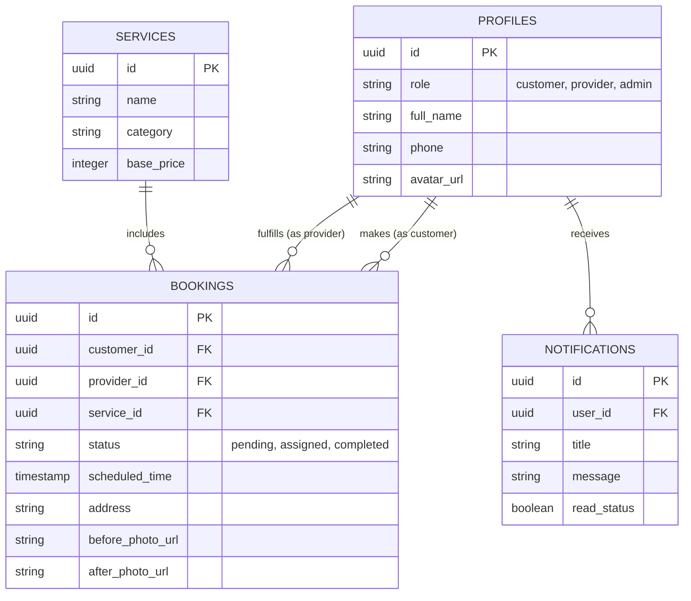

# Implementation Methodology

## 2.1 Design
The design of **LocalFix** follows a modern, component-based architectural pattern utilizing React. 
- **Architectural Pattern:** It employs a unified Client-Server architecture where the React frontend acts as the thick client, making secure REST and WebSocket calls to the Supabase Backend-as-a-Service (BaaS).
- **UI/UX Design:** The interface adopts the "Obsidian Luxe" design aesthetic. It is strictly **mobile-first**, ensuring that service providers in the field and customers on their phones have a seamless experience. It uses `shadcn/ui` for standardized accessibility and `Tailwind CSS` for rapid, responsive styling.
- **State Design:** The application state is decoupled. Server state (database data) is managed and cached by `React Query` (TanStack), while local UI state is managed via React Context and Hooks.

## 2.2 Hardware, Software Requirements
### Hardware Requirements:
- **Developer/Admin Machine:** Any standard PC/Laptop (Windows, macOS, Linux) with a minimum of 4GB RAM (8GB recommended) and an active Internet connection.
- **End-User / Customers:** Any smartphone, tablet, or PC with an internet connection.
- **Service Providers:** A smartphone with a functional built-in camera to capture "Before" and "After" evidence photos.

### Software Requirements:
- **Operating Environment:** Node.js (v18+) for local development.
- **Web Browser:** A modern browser (Google Chrome, Mozilla Firefox, Safari, Edge) with JavaScript and HTML5 Media (Camera) API support.
- **Code Editor:** Visual Studio Code (VS Code) or similar IDE.
- **Backend Infrastructure:** Supabase account (providing managed PostgreSQL). 

## 2.3 ER Diagram for the website
Below is the structural representation of the Entity-Relationship mapping used in the PostgreSQL database. 

*(You can copy the code block below into [Mermaid Live Editor](https://mermaid.live/) to generate an actual diagram image for your report)*



## 2.4 Module Implementation
The system is divided into four primary functional modules:
1. **Customer Module:** 
   - Responsible for user registration, multi-language toggling, exploring the service catalog, and the checkout/booking multi-step form. Integrates real-time tracking of their requested jobs.
2. **Service Provider Module:** 
   - Provides a dedicated dashboard for workers to accept/reject assigned jobs. Includes the implementation of the HTML5 Camera API to securely capture live environmental photos, upload them to Supabase Storage, and mark jobs as completed.
3. **Admin Module:** 
   - A centralized command center providing oversight over all active bookings. Admins utilize this module to manually orchestrate the workflow by assigning incoming customer requests to available service providers.
4. **AI/Bot Module:**
   - Implements a floating persistent React component (`AIChatBot.tsx`) connected to a Supabase Edge Function that routes user queries to the Google Gemini API, providing 24/7 intelligent automated assistance.

## 2.5 Database Connectivity
The project achieves database connectivity not via traditional backend server code (like Node/Express), but through **Supabase's managed endpoints**.
- **The Client:** Connectivity is initialized using `@supabase/supabase-js`, which creates a persistent, secure connection instance based on the Project URL and Anon Key.
- **Security (RLS):** Because the frontend queries the database directly, security is handled on the database level using PostgreSQL Row Level Security (RLS) policies. For example, a policy ensures a Customer can only `SELECT` their own bookings, while an Admin can select all bookings.
- **Real-time Connect:** The project utilizes Supabase Channels (WebSockets) to actively listen to database row inserts/updates, instantly pushing UI updates to the user (e.g., triggering a pop-up when an admin assigns a provider).

## 2.6 Code
The codebase is structured efficiently using React and Vite. Here are short snippets exemplifying the core implementation logic you can include in the report:

**1. Connecting to the Database (Supabase Client Setup):**
```typescript
import { createClient } from '@supabase/supabase-js';

const supabaseUrl = import.meta.env.VITE_SUPABASE_URL;
const supabaseAnonKey = import.meta.env.VITE_SUPABASE_ANON_KEY;

// Establishes secure connection to the database
export const supabase = createClient(supabaseUrl, supabaseAnonKey);
```

**2. Fetching Dynamic Services (React Context/Query):**
```typescript
// Querying the 'services' table from the database
const { data: services, isLoading } = useQuery({
  queryKey: ['services'],
  queryFn: async () => {
    const { data, error } = await supabase
      .from('services')
      .select('*')
      .order('category');
      
    if (error) throw error;
    return data;
  }
});
```

## 2.7 Steps to Launch the website on Internet
The platform uses an automated CI/CD pipeline capable of launching immediately to edge CDNs. 

**Step 1: Code Repository Preparation**
- Push the local codebase to a GitHub repository.

**Step 2: Backend Cloud Setup (Supabase)**
- Create a new project on Supabase.
- Run the required SQL migration files (e.g., `setup_db.sql`) in the Supabase SQL editor to scaffold the database tables and RLS policies.
- Retrieve the unique API keys provided by Supabase.

**Step 3: Hosting Platform Configuration (e.g., Vercel or Netlify)**
- Create an account on Vercel and import the GitHub repository.
- Vercel automatically detects Vite/React. 
- Input the environmental variables securely in the Vercel dashboard:
  - `VITE_SUPABASE_URL`
  - `VITE_SUPABASE_ANON_KEY`
  - `VITE_GEMINI_API_KEY`

**Step 4: Deployment & Build**
- Trigger the build process. Vercel executes `npm run build` to compile the TypeScript/React code into optimized, minified static HTML/CSS/JS bundles.
- Upon successful build, Vercel automatically deploys the bundles to a global Edge Network, providing a live HTTPS URL to access the platform. Any future pushes to the `main` branch will automatically trigger a re-build and seamless update.
